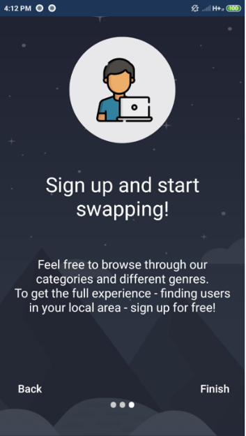
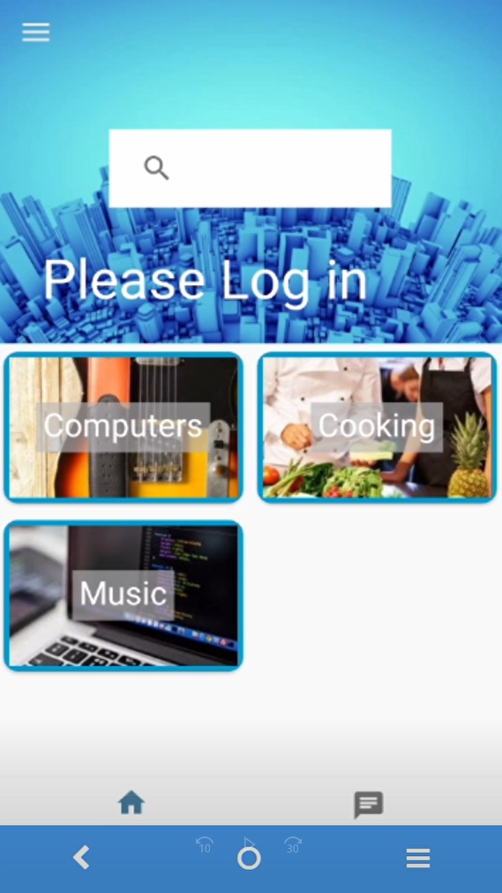
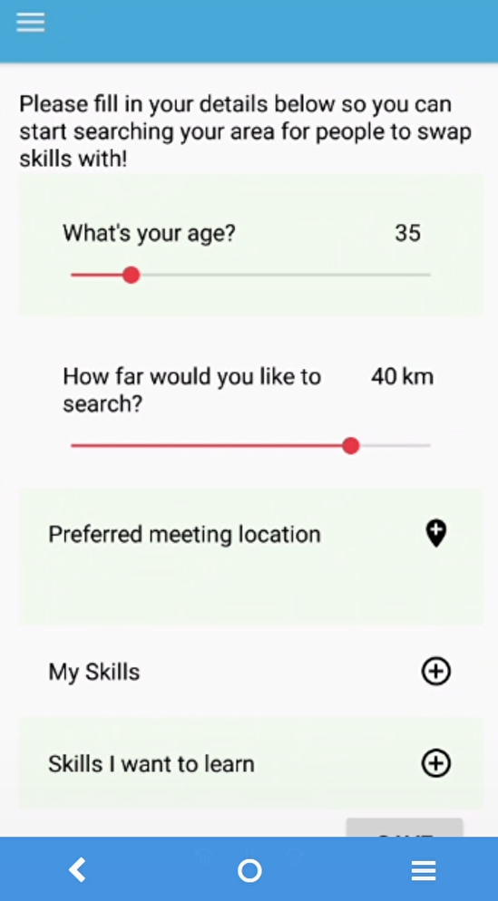
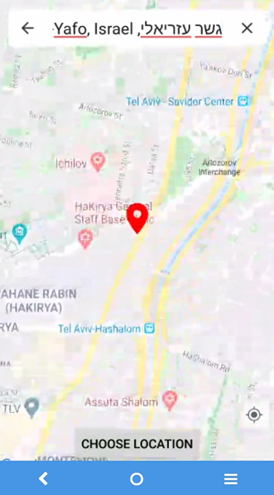
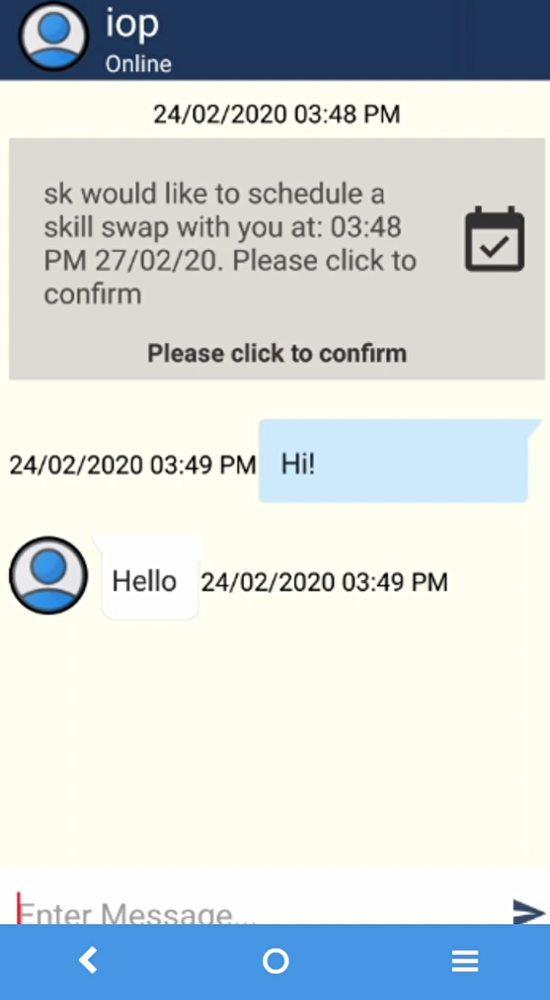
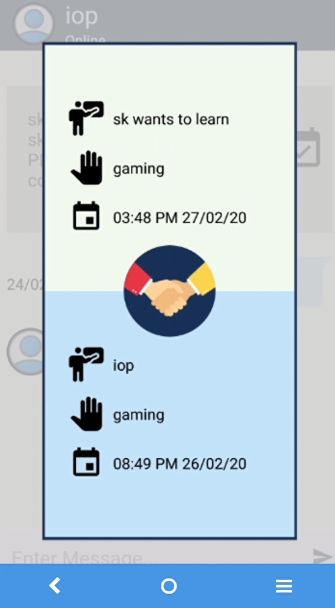
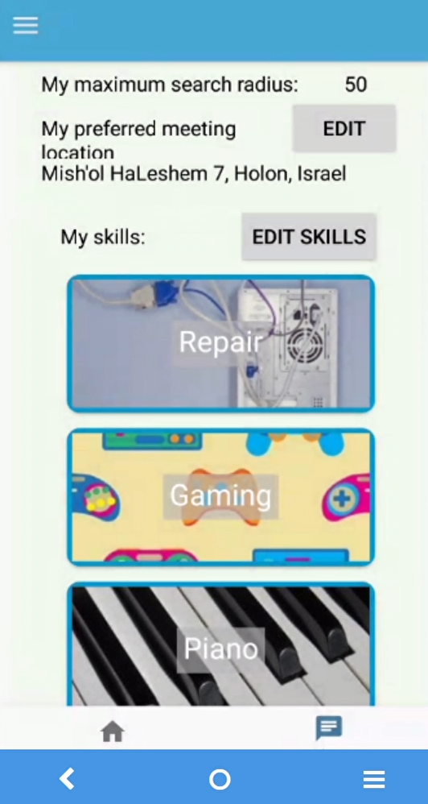
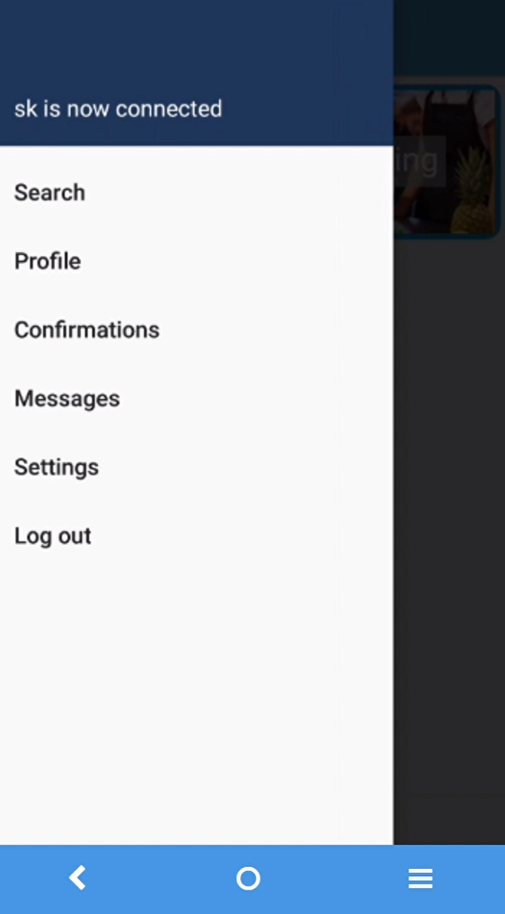

# Skill Deal

### Introduction
The purpose of the app is to gain new skills by meeting people who are in our area and without the need for currency or money.  
When the first user finds skills he wants to learn from the second user,  
And the second user has found skills he wants to learn from the first user,   
they will set to meet on a specific date and time and exchange skills.  
-The target audience of the app is for people who prefer to study with someone else and also while getting to know them!   
the app contains:  

Chat with friends , camera , GPS and various social related options  

### Database 

Firebase

### Technology 
JAVA , Android.

### GIT
https://github.com/maorte/Skill_Deal_Social_Mobile_App

### Youtube
https://youtu.be/cqe24wU6sqM

   
   
   
   
   
   
   
   
